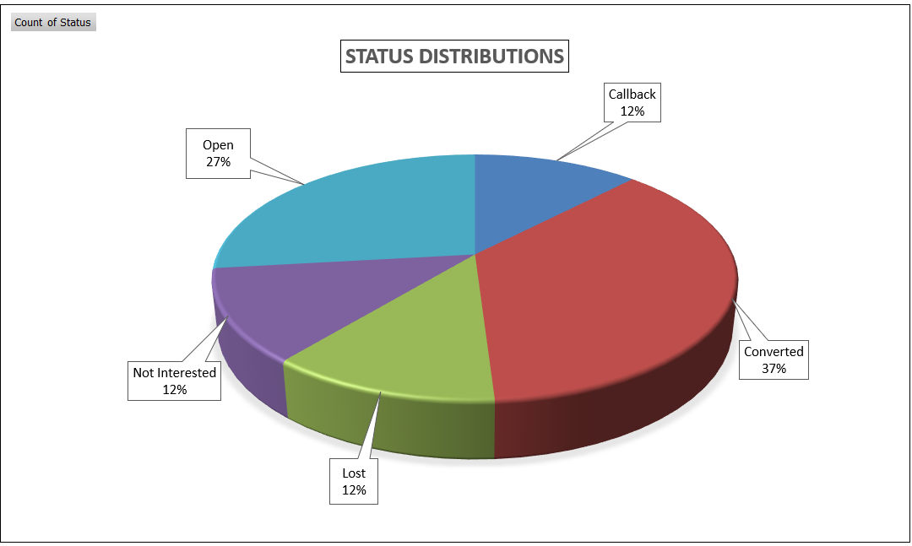
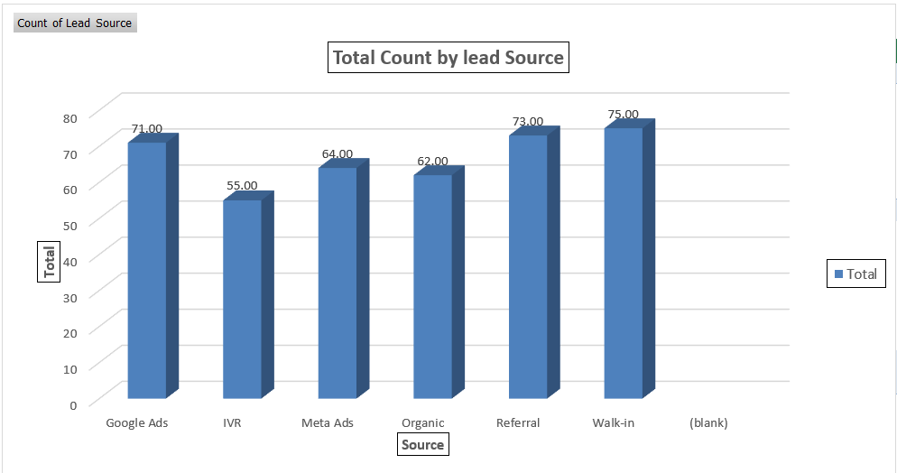
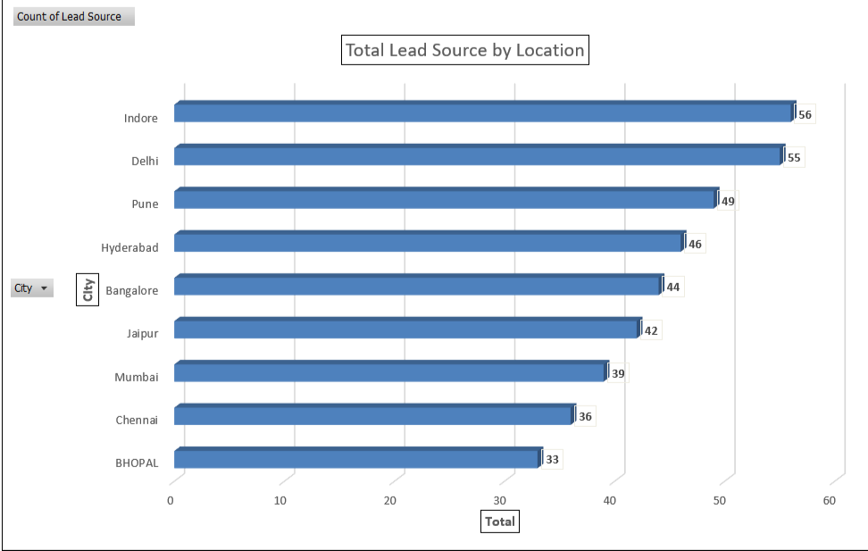
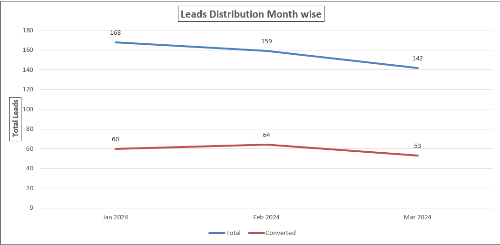
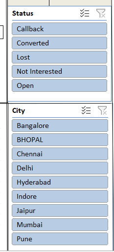

# 📊 Real Estate CRM Lead Management & Analysis — 2024

> An MIS (Management Information Systems) assignment project analyzing 500 CRM leads for a real estate business. Covers end-to-end data cleaning, lead funnel tracking, agent performance evaluation, and an interactive Excel dashboard with pivot tables.

---

## 📁 Project Structure

```
crm-lead-analysis_using_excel/
│
├── MIS-crm-lead-analysis.xlsx       # Main Excel workbook (all sheets)
├── README.md                     # Project documentation
├── screenshots/                  # Dashboard & chart screenshots
│   ├── dashboard.png
│   ├── summary.png
│   └── pivot_table.png
└── report/                       # (Optional) Written report / PDF
    └── MIS_Analysis_Report.pdf
```

---

## 📌 Project Overview

This project simulates a real-world CRM (Customer Relationship Management) scenario for a real estate company. Raw lead data with inconsistencies was cleaned, analyzed, and visualized to derive business insights.

| Metric              | Value         |
|---------------------|---------------|
| Total Leads         | 500           |
| Converted Leads     | 184 (36.8%)   |
| Open / Callback     | 195           |
| Lost / Not Interested | 121         |
| Time Period         | Jan – Mar 2024 |

---

## 🗂️ Excel Workbook Sheets

### 1. `Raw CRM Dump`
Original messy data exported from a CRM system. Contains issues like:
- Inconsistent date formats (DD/MM/YYYY, YYYY-MM-DD, text dates)
- Inconsistent agent name spellings (R.Singh, Rohit S, rohit sharma)
- Mixed phone number formats (+91, 91, dashes, spaces)
- Inconsistent lead status values (converted, Converted, CONVERTED)
- Missing values in phone, email, city, and follow-up columns

### 2. `Cleaned Data`
Standardized version of the raw data after applying data cleaning rules:
- Uniform date format (DD-Mon-YYYY)
- Standardized agent names and lead statuses
- Normalized phone numbers
- Consistent Yes/No for Follow-up Done column

### 3. `Summary`
Aggregated metrics and KPIs:
- Lead status breakdown with share percentages
- Leads by source (Google Ads, Meta Ads, Referral, Walk-in, IVR, Organic)
- Agent-wise performance table with conversion rates and rankings

---

### 4. `Dashboard & Key Insights`

Visual dashboard built with Excel pivot tables and charts:

1. ### Executive KPI Summary Card


### Key Insights

**Total Volume:** Out of **500** total leads processed in the database, the sales funnel successfully closed **184** conversions.
**Efficiency Benchmark:** This establishes an overall baseline Conversion Rate of **36.80%** across all marketing channels and regions

---

2.  ### Lead status distribution



### Key Insights

**Analysis:** The pipeline shows a strong 37% Conversion Rate, demonstrating high-intent leads and effective sales closing scripts. With 27% of leads remaining "Open", there is a clear, immediate opportunity for automated email/SMS nurturing campaigns to recapture pending revenue.

---

3.  ### Marketing Channel Performance


    
### Key Insights

**Analysis:** Lead generation is well-distributed across channels, with direct Walk-ins (75) and Referrals (73) driving the highest volumes, closely followed by Google Ads (71). \
This highlights strong organic/offline brand equity alongside viable paid digital performance.

---

4. ###  Geographic lead distribution



**Analysis:** Indore (56) and Delhi (55) emerged as the primary geographical hubs for lead acquisition, closely followed by Pune (49). \
This data helps regional sales managers optimize local territory mapping and ad targeting.

---
5. ### Lead Conversion Trend (Month-over-Month)



 ### Key Insights
 
 **Analysis:** Shows a slight downward trend in total inbound leads from January (168) to March (142).
---

6. ### 🎛️ Interactive Dashboard Controls (Excel Slicers)


 
**Dynamic Calculations:** Clicking a **slicer** automatically recalculates the charts in real-time—allowing users to drill down into specific questions, \
such as: "What is the conversion rate strictly for Google Ads in Indore?"

---

## 🛠️ Tools & Skills Used

- **Microsoft Excel** — Data cleaning, pivot tables, dashboard design
- **Excel Functions** — `IF`, `TRIM`, `PROPER`, `TEXT`, `COUNTIF`, `VLOOKUP`
- **Pivot Tables** — Multi-dimensional analysis by agent, source, status, city, month
- **Data Visualization** — Bar charts, donut charts, KPI cards in Excel
- **MIS Concepts** — CRM data management, lead funnel analysis, reporting

---

## 📚 Assignment Context

- **Subject**: Management Information Systems (MIS)
- **Assignment Type**: Data Analysis & Reporting
- **Domain**: Real Estate CRM
- **Dataset Size**: 500 leads across 10 columns

---

## 🚀 How to Use

1. Clone or download this repository
2. Open `MIS-crm-lead-analysis.xlsx` in Microsoft Excel (2016 or later recommended)
3. Start with the `Raw CRM Dump` sheet to see original data
4. Review `Cleaned Data` to understand transformations applied
5. Explore `Summary` for KPIs and metrics
6. View `Dashboard & Pivot Table` for visual insights

> ⚠️ Some Excel features (slicers, conditional formatting) may not render correctly in Google Sheets or LibreOffice.

---

## 👤 Author

**[Aakash Chourasiya]**
- 📧 aakashchourasiya81@gmail.com
- 🎓 SKGI, Indore
- 📅 Submitted: March 2026

---

## 📄 License

This project is submitted as part of an academic assignment. Not for commercial use.
